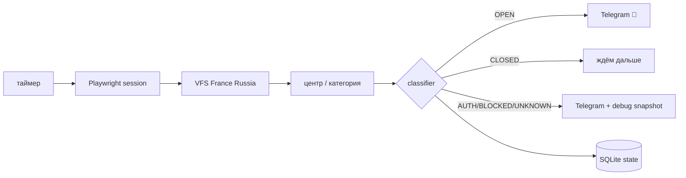

# VFS France Russia Slot Monitor 🇫🇷

Персональный монитор свободных слотов на подачу французской визы через **VFS Global Russia**.

MVP делает ровно то, что нужно для первой рабочей версии:

- открывает официальный портал France / Russia через Playwright;
- использует одну сохранённую браузерную сессию VFS;
- проверяет несколько визовых центров и категорий;
- различает `OPEN`, `CLOSED`, `AUTH_REQUIRED`, `BLOCKED`, `UNKNOWN`;
- присылает Telegram-уведомление при появлении слота или проблеме с сессией;
- не спамит одинаковыми уведомлениями благодаря SQLite-дедупликации;
- сохраняет screenshot + text snapshot, если VFS поменял интерфейс;
- имеет Docker, тесты и GitHub Actions.

> Проект **не бронирует запись автоматически** и **не обходит CAPTCHA / WAF / rate limits**.
> Это сознательное ограничение MVP: сначала нужен надёжный мониторинг, который не убивает VFS-аккаунт.

## Как это работает



## Текущий VFS endpoint

По умолчанию используется:

```text
https://visa.vfsglobal.com/rus/ru/fra/dashboard
```

URL можно заменить через `VFS_DASHBOARD_URL`, не меняя код.

## Быстрый старт

Требования: Python 3.12+.

```bash
git clone https://github.com/TimofeyYA1/vfs_bot_rus.git
cd vfs_bot_rus

cp .env.example .env
cp targets.example.yml targets.yml

python -m venv .venv
source .venv/bin/activate

python -m pip install -e ".[dev]"
playwright install chromium
```

На Windows активация окружения:

```powershell
.venv\Scripts\Activate.ps1
```

### 1. Telegram

Создай бота через BotFather, напиши ему любое сообщение и заполни:

```dotenv
TELEGRAM_BOT_TOKEN=...
TELEGRAM_CHAT_ID=...
```

### 2. Настрой цели

`targets.yml`:

```yaml
targets:
  - id: moscow-short-stay
    enabled: true
    center: Moscow
    category: Short Stay
    subcategory: All kind of other short stay visas
    date_from: 2026-09-24
    date_to: 2026-11-30
```

`center`, `category`, `subcategory` должны совпадать с вариантами, которые реально показывает
VFS. Матчинг допускает частичное совпадение и не зависит от регистра.

Чтобы мониторить несколько городов, просто добавь несколько объектов в `targets`.

### 3. Проверь конфиг

```bash
python -m vfs_bot validate
```

### 4. Один раз авторизуй браузер

Рекомендуемый вариант:

```bash
python -m vfs_bot bootstrap
```

Откроется обычный Chromium. Войди в VFS самостоятельно, пройди CAPTCHA/OTP если они появятся,
после появления dashboard вернись в терминал и нажми Enter.

Сессия сохранится в:

```text
.data/vfs-storage-state.json
```

Файл содержит чувствительные cookies и **никогда не должен попадать в Git**.

Можно указать `VFS_EMAIL` / `VFS_PASSWORD` в `.env`, тогда бот попробует обычный логин сам.
Если VFS запросит CAPTCHA или дополнительное подтверждение, состояние станет `AUTH_REQUIRED`.

### 5. Сделай одну тестовую проверку

```bash
python -m vfs_bot once
```

Только когда результат выглядит правильно:

```bash
python -m vfs_bot run
```

## Интервал проверки

По умолчанию:

```dotenv
CHECK_INTERVAL_SECONDS=120
CHECK_JITTER_SECONDS=30
```

То есть новая проверка начинается примерно раз в 120–150 секунд.

Ставить 2–5 секунд бессмысленно: это не делает VFS добрее, зато повышает шанс rate limit,
сброса сессии и прочих проявлений человеческой веры в polling.

## Telegram-события

Бот сообщает:

- 🚨 `OPEN` — есть признаки доступных дат/времени;
- 🔐 `AUTH_REQUIRED` — сессия умерла или VFS просит ручное подтверждение;
- ⛔ `BLOCKED` — похожее на WAF/rate-limit состояние;
- ⚠️ `UNKNOWN` — VFS изменил страницу и нужно проверить debug snapshot;
- 💚 heartbeat — периодическое подтверждение, что процесс жив.

Одинаковое состояние не отправляется снова без изменения fingerprint.

## Диагностика

На неизвестных состояниях создаются:

```text
.data/debug/<timestamp>_<target>_unknown.png
.data/debug/<timestamp>_<target>_unknown.txt
```

Это позволяет чинить селекторы по фактической странице, а не гадать по звёздам.

Подробнее: [`docs/RUNBOOK.md`](docs/RUNBOOK.md).

## Docker

Сначала сделай `bootstrap` локально, чтобы получить VFS storage state.

```bash
docker compose up -d --build
docker compose logs -f
```

Контейнер монтирует `.data/`, поэтому session state и SQLite переживают рестарты.

## Структура

```text
src/vfs_bot/
├── browser.py      # Playwright + VFS interaction
├── classifier.py   # OPEN/CLOSED/AUTH/BLOCKED/UNKNOWN
├── cli.py          # bootstrap / once / run / validate
├── config.py       # .env + targets.yml
├── models.py       # typed domain models
├── monitor.py      # polling + jitter + heartbeat
├── notifier.py     # Telegram
└── storage.py      # SQLite dedupe
```

Архитектура: [`docs/ARCHITECTURE.md`](docs/ARCHITECTURE.md).

## Тесты и lint

```bash
pytest -q
ruff check .
```

То же самое выполняется в GitHub Actions на каждом PR.

## Что дальше

После стабилизации мониторинга можно добавить:

1. точное извлечение доступных дат и времени из актуальной разметки VFS;
2. команды Telegram `/status`, `/pause`, `/resume`;
3. отдельные интервалы для разных центров;
4. метрики/health endpoint;
5. полуавтоматический переход к форме записи после уведомления.

Автоматическое бронирование специально не входит в MVP: сначала монитор должен доказать, что
он корректно переживает реальные сессии, истечение cookies и изменения интерфейса.

## Disclaimer

Используй проект только в соответствии с правилами VFS Global и применимым законодательством.
Сервис не аффилирован с VFS Global или France-Visas.
