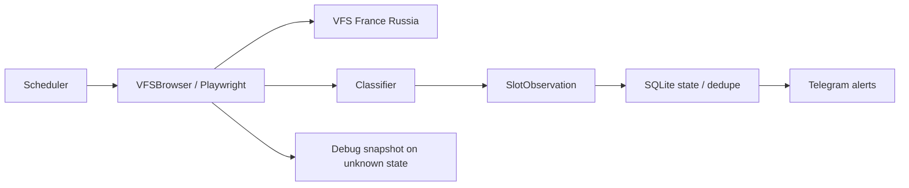

# Architecture

The MVP deliberately avoids CAPTCHA solving, proxy rotation and anti-bot bypasses.
It behaves like one persistent user browser session and monitors configured appointment targets.

## Components

- `config.py` — environment and `targets.yml`.
- `browser.py` — stateful Chromium session, login/session reuse and VFS form interaction.
- `classifier.py` — conservative state detection: `OPEN`, `CLOSED`, `AUTH_REQUIRED`, `BLOCKED`, `UNKNOWN`.
- `storage.py` — tiny SQLite state store used to suppress duplicate alerts.
- `monitor.py` — polling loop, jitter, heartbeat and stop-on-block behavior.
- `notifier.py` — Telegram Bot API.
- `.data/vfs-storage-state.json` — Playwright session storage, never committed.
- `.data/debug/*` — screenshots/text for unknown or blocked pages, never committed.

## Why the classifier is conservative

A false negative is annoying. A false positive at 03:00 is also annoying, but less destructive than
silently interpreting a changed VFS page as "no slots". Unknown markup becomes `UNKNOWN` and produces
a diagnostic snapshot so selectors can be updated safely.

## Rate limiting

The default interval is 120 seconds plus random jitter. Do not reduce it aggressively. VFS can
invalidate sessions or rate-limit traffic. When the browser detects a blocked page, the monitor stops
checking the remaining targets in that cycle.
